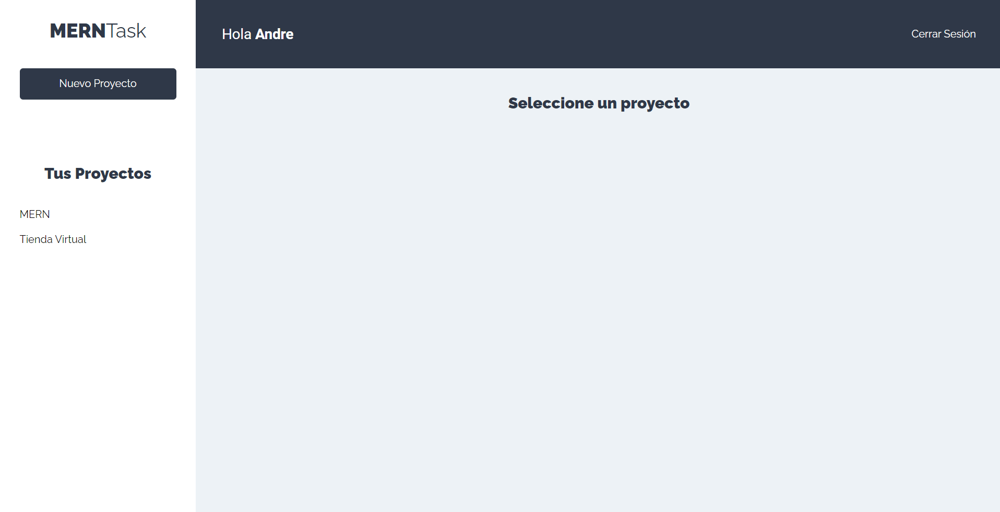
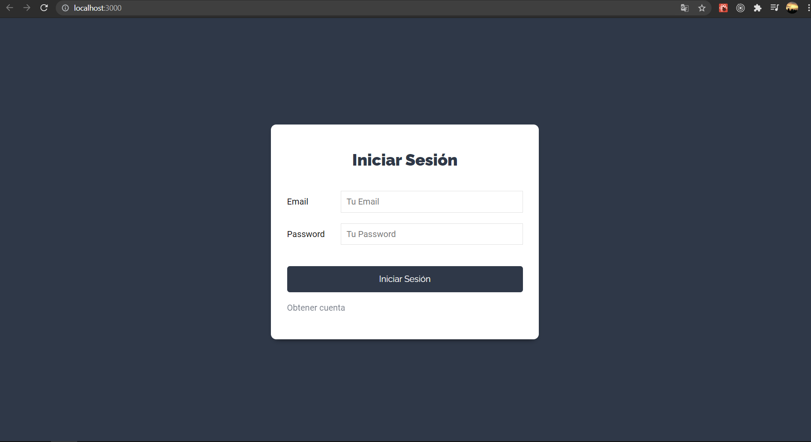
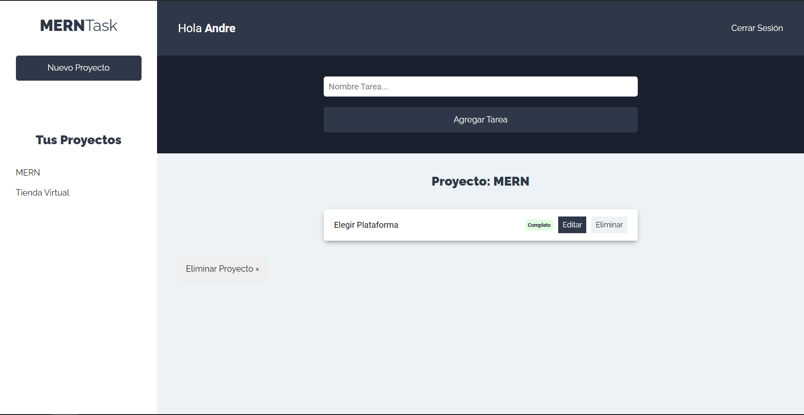

# TASK - admin - React - typescript - hooks - axios

#### Comandos para arrancar el proyecto

**yarn  start:** inicia la aplicacion en modo desarrollo
**yarn build:** para generar el compilado.
**yarn json-server:** para levantar la api para el CRUD.

# Descripcion
- Se maqueto con css
- Contiene un CRUD y authentificacion de usuarios
- Conexion a un REST Api

# Imagenes

